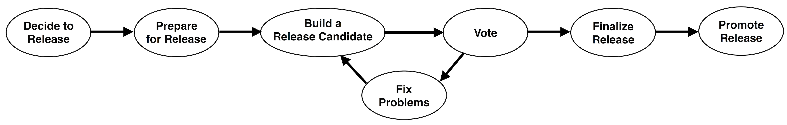

Each release should be executed by a Release Manager, who is selected/proposed by the steering committee. This document describes the process that the Release Manager follows to perform a release. Any changes to this process should be discussed and adopted on the dev@ mailing list.

This release process should be strictly followed by Pravega and also followed by the following ecosystem projects inside Pravega organization.

- [Pravega Keycloak Client](https://github.com/pravega/pravega-keycloak)
- [Pravega Schema Registry](https://github.com/pravega/schema-registry)
- [Pravega Flink Connector](https://github.com/pravega/flink-connectors)
- [Pravega Spark Connector](https://github.com/pravega/spark-connectors)
- [Pravega Samples](https://github.com/pravega/pravega-samples)

These projects can have its own release instruction page that points to this one as a reference and then explains what is different.

If you are releasing the project, then you must read and follow the instructions carefully. The releases are a public face of the project and most users interact with the project only through the releases, so they need to be treated with great importance.

# Overview



The release process consists of several steps:

1. Decide to release
2. Prepare for the release
3. Build a release candidate
4. Vote on the release candidate
5. If necessary, fix any issues and go back to step 3.
6. Finalize the release
7. Promote the release

As the current projects have dependencies within these projects, the formal release should happen in the following order.

> Pravega -> Pravega Keycloak Client / Pravega Spark Connector -> Pravega Schema Registry -> Pravega Flink Connector -> Pravega Samples

# Decide to release
Deciding to release is the first step of the release process. Any committer can propose to start the release process by proposing to start a new release on the mailing list, giving 72 hours for people to respond and volunteer for release manager. If there are no concerns, then the committer can proceed. If there are concerns or objections, then the Steering Committee can arbitrate and resolve it.

## Select a release manager

All the project committers can volunteer to be the release manager by replying to the release decision mail, and the steering committee can select or propose one as the release manager.

If there are multiple volunteers, the steering committee should discuss and select a release manager, preferrably on a first-come-first-serve basis. All the other volunteers will be backup candidates if the designated one is unavailable or unable to perform their duties.

If there is no volunteer or backup, the steering committee will need to discuss and choose one from the previous release managers as the release manager.

Release managers should take responsibility to track the release progress and perform the actions during the whole release phase, and is responsible for all releases associated with a major release(i.e., 0.7.x, which included 0.7.0 through 0.7.3).

# Prepare for the release

Before your first release, you should perform one-time configuration steps. This will set up your security keys for signing the release and access to various release repositories.

## One-time configuration steps

1. A set of GPG signing key and password, which will be used for signing the artifacts. follow these [Github instructions](https://help.github.com/en/articles/generating-a-new-gpg-key) for generating and configuring one.

GnuPG 2.1 switched to a new keyring format, for which the keys are stored in the `pubring.kbx` file. Since the release requires a `secring.gpg` file, you could create one like this:

```
# List the keys
gpg --list-secret-keys --keyid-format LONG

# Locate the key id, which is of the form `Dg4D421F...`

# Create the secring.gpg
gpg --export-secret-key <Your key-id> > ~/.gnupg/secring.gpg
```

2. Sonatype username/password with access to the `io.pravega` group. See this [guide](http://central.sonatype.org/pages/ossrh-guide.html) for how to create an account. You need to comment in this [ticket](https://issues.sonatype.org/browse/OSSRH-30708) and ask someone who already has deployer access to approve in order to get the permission to the `io.pravega` group.

3. Dockerhub username/password with access to the Pravega repository (Only required for Pravega)

For setting up docker see: https://docs.docker.com/engine/install/ubuntu/

For configuring to run as a non-root user see: https://docs.docker.com/engine/install/linux-postinstall/, https://docs.docker.com/engine/security/rootless/

## Announcing the release process starts
When starting the release process, a Pravega release manager creates a new release Slack channel on `pravega.io` named after the release version, e.g., `pravega-release-090` for release `0.9.0`. The release manager posts release progress as new steps are executed; reporting progress is critical so that the community knows what is happening. All the ecosystem projects release managers must be invited into this channel for continuous discussion. All contributors can join this channel and discuss about the release in it, but still keep in mind that the candidate announcing and voting should still happen and only take effect on the dev mailing list. To let the community know that cutting a release is in progress, it is important to announce it on the `#dev` Slack channel.

## Preparing the release notes
Please gather the information of the highlight features and important fixes in the release from all committers and new feature contributors, then prepare the release notes. You can also refer to previous releases for an example of how to put together notes.

## Preparing the branch

There are two possible situations:

* Bug-fix release: This is a minor release version over an existing release branch, there is NO NEED to create a new branch.
* Feature release or non-backward-compatible release: This is a major release based on `master` branch. This is a version change to either the first or the middle digit, and it requires a new release branch.

When a new release branch needs to be created, you first need to tag the forking point on master branch and then create the release branch named as `rX.Y`. Assuming for the sake of example that the new release is `0.3.0`, the detailed commands needs to be executed.

```
# Tag the branch cut position with `branch-X.Y`
git checkout master
git tag branch-0.3
git push origin branch-0.3

# Create the release branch `rX.Y`
git checkout -b r0.3
git push origin r0.3
```

Now the release branch is ready to go.

# Build a release candidate

When the community has the consensus to start a release candidate without any concerns or objections on open release-blocking issues, you can start to build a release candidate.

Pravega release managers should keep in mind that the core of the release process is the build-vote-fix cycle. Each cycle produces one release candidate. The Release Manager repeats this cycle until the community approves one release candidate, which is then finalized.

To start a release candidate, you now need to do several things:
- Create and tag the release candidate on github
- Deploy jar artifacts to the Sonatype Repository, which is the staging area for deploying the jars to Maven Central

## Tagging the candidate on Github
First make sure you work on the release branch named `rX.Y`, e.g, `r0.3`. 

Before you execute any command, double check and keep these two things in mind.
- What version we want to release as `X.Y.Z`, e.g, `0.3.0`
- The release candidate number `N`. The number `N` starts with 0 and increment for each candidate.

Next, follow the below steps carefully to start a release candidate, here we still take `0.3.0` release as an example, so you need to replace with the correct version and number in some places.

1. Create a new _temporary_ release branch on the latest commit of `rX.Y` branch, named as `release-X.Y.Z-rcN`, e.g. `release-0.3.0-rc0`. (The "temporary" here means that you need to clean up the branch after the process finishes)

```
// Make sure you are on the right commit
git checkout -b release-0.3.0-rc0
```

2. Remove the `-SNAPSHOT` suffix in all the versions of Pravega projects in `gradle.properties`. For example, if the current value is `pravegaVersion=0.3.0-SNAPSHOT`, then change it to `pravegaVersion=0.3.0`.

3. Push this commit onto the release branch. The commit message should be `Add release X.Y.Z`. A pull request is NOT required for this commit.
```
git commit -s -am "Add release 0.3.0"
git push origin release-0.3.0-rc0
```

4. Tag the commit with `vX.Y.Z-rcN` and push this tag. For example, `v0.3.0-rc0`.
```
git tag v0.3.0-rc0
git push origin v0.3.0-rc0
``` 

5. Delete the temporary release branch.
```
git branch -D release-0.3.0-rc0
```

## Staging the binary releases

Build the binaries with the following command, there could be some slight differences regarding the parameters and plugin used for publishing.
```
./gradlew clean assemble publish -PdoSigning=true -Psigning.password=<signing-password> -PpublishUrl=mavenCentral -PpublishUsername=<sonatype-username> -PpublishPassword=<sonatype-password>
```

* Login to [Nexus Repository Manager](https://oss.sonatype.org) using sonatype credentials with write access to io.pravega group.
* Under Build Promotion -> Staging Repositories
  * Drop the staging repository of the previous rejected release candidate if there is one
  * Locate the staging repository that was created for the latest publish (format iopravega-XXXX, for example iopravega-1004)
* Select the repository and click the "Close" button in the top menu bar. This will perform validations to ensure that the contents meets the maven requirements (contains signatures, javadocs, sources, etc). This operation takes a short time to complete, press the Refresh button in the top menu bar occasionally until the operation completes.
* Once the operation completes, locate the URL field in the Summary tab of the newly closed repository (it will be something like https://oss.sonatype.org/content/repositories/iopravega-XXXX where XXXX is the number of the staging repository). This should be tested to ensure that all artifacts are present and functions as expected.

## Staging the docker images

The docker images should also be staged to the release manager's personal repository for validation from Docker/Kubernetes users. This can be done with the below command.
```
./gradlew clean docker dockerPush -PpravegaBaseTag=<docker-username>/pravega -PbookkeeperBaseTag=<docker-username>/bookkeeper -PpravegaVersion='X.Y.Z-rcN'
```

# Vote on the release candidate

## Announcing for voting
Once you have built and individually reviewed the release candidate, please share it for community review. The voting must happen in the dev mailing list (`cncf-pravega-dev@cncf.io`) for this release candidate and reference the link in the release Slack channel.
- The link of the github release candidate tag
- The Sonatype staging repository
- Docker image repository
- The release notes

Here is the Email template.
```
Hi everyone,
Please review and vote on the release candidate #0 for the version 0.3.0, as follows:
+1, Approve the release
-1, Do not approve the release (please provide specific comments)

Github link: https://github.com/pravega/pravega/releases/tag/v0.3.0-rc0
Sonatype link: https://oss.sonatype.org/content/repositories/iopravega-1004
Docker Image: brianzhou/pravega:0.3.0-rc0
Release notes: https://gist.github.com/crazyzhou/f53ccfc395ce35f4d09bc2a27dsbcf69
```

## Voting process
The community including the release manager will be responsible for verifying the release candidate. Anyone can vote +1 or -1 on the release candidates, which helps to gain more confidence on the release. The vote happens on the dev mailing list. The necessary conditions for the release vote to pass are shown [here](https://github.com/pravega/.github/blob/main/governance.md#actions).

There are a few things to check including

- No open release-blocking issues
- All the unit and integration tests pass
- Checksums of the artifacts and source code are correct
- Verify that it can locate, build and run with the staging artifacts. For example, use the [Pravega samples](https://github.com/pravega/pravega-samples) to verify.
- Docker images can run in a container successfully

It is possible that a release candidate is problematic or denied. In this case, you need to announce the cancellation of this vote, and then fixes issues and repeats the cycle.

Once the community passes the vote, you announce the vote result in both the dev mailing list and in the release Slack channel.

# Fix any issues
Any issues identified during the community review and vote should be fixed in this step.

Code changes should be proposed as standard pull requests to the `master` branch and reviewed using the normal contributing process. Then, relevant changes should be cherry-picked into the release branch. The cherry-pick commits should then be proposed as the pull requests against the release branch, again reviewed and merged using the normal contributing process.

Once all issues have been resolved, you should go back and build a new release candidate with these changes.

# Finalize the release

Once the release candidate has been reviewed and approved by the community, the release should be finalized. This involves the github release announcement, deployment of the jar artifacts on maven central, document updates, official docker images publish, etc.

## Step 1: Tagging
```
# Checkout to the latest successful-voted tag
git checkout v0.3.0-rc2
# Tag this existing tag again as a formal release tag `v0.3.0` and push
git tag v0.3.0
git push origin v0.3.0
```

## Step 2: Create the release page on GitHub

On the GitHub repository page, go to "Releases" and create a new draft. On the draft, fill out the tag field with the correct tag and do NOT check the pre-release box. There are two sections needs to be filled in this github page.
- Release notes
- Release assets

### Release notes
Some introductory text, highlighting the important changes going in the release. This should be reviewed earlier by the community.

### Release assets

Run the following commands to build the distribution artifacts
```
./gradlew clean distribution
```

The files resulting from the build will be under `build/distributions`. For each one of the `.zip`, `.tgz` or `.jar` files in that directory, generate checksums (currently `md5`, `sha1`, and `sha256`). It is easy to do with this bash script.
```
#!/bin/bash

for file in ./*.tgz ; do md5 $file > $file.md5 ; done
for file in ./*.tgz ; do shasum -a 1 $file > $file.sha1 ; done
for file in ./*.tgz ; do shasum -a 256 $file > $file.sha256 ; done
for file in ./*.tgz ; do gpg --armor --output $file.asc --detach-sig $file ; done

for file in ./*.zip ; do md5 $file > $file.md5 ; done
for file in ./*.zip ; do shasum -a 1 $file > $file.sha1 ; done
for file in ./*.zip ; do shasum -a 256 $file > $file.sha256 ; done
for file in ./*.zip ; do gpg --armor --output $file.asc --detach-sig $file ; done

for file in ./*.jar ; do md5 $file > $file.md5 ; done
for file in ./*.jar ; do shasum -a 1 $file > $file.sha1 ; done
for file in ./*.jar ; do shasum -a 256 $file > $file.sha256 ; done
for file in ./*.jar ; do gpg --armor --output $file.asc --detach-sig $file ; done
```
Upload all these files and its checksums onto the "Assets" section.

Finally, double check all the content is correct and then you can click the "Publish" button to publish the formal github release.

## Step 3: Release the artifact to maven central

Choose the latest release candidate in sonatype and click on the "Release" button in the top menu bar to release the artifact. Wait until it shows up in Maven Central, it takes some [time](http://central.sonatype.org/pages/ossrh-guide.html#SonatypeOSSMavenRepositoryUsageGuide-9.ActivateCentralSync).

## Step 4: Documentation

Generate the documentation and update onto the website.

## Step 5: Push the images to Docker Hub
For this step, you need a Docker Hub account associated to Pravega.

Once you are ready, run the following steps:

```
// Using a dockerhub account with write access
docker login
// This pushes the specific version tags
./gradlew clean docker dockerPush
// This updates the latest tags, if desired
docker push pravega/pravega:latest & docker push pravega/bookkeeper:latest
```

Note: You might need to use `sudo` to run the last two commands.

# Promote the release

After the release is done, please share the release announcement in both `#general` and `#dev` slack channels. Posting to the release Slack channel is optional as the release Slack channel can be archived at this point.

## Cleanups

Please double check that there are no staging repositories for this release on sonatype, and drop if there is some left.

Once the release is done, create an issue and corresponding pull request to change the `pravegaVersion` in `gradle.properties` to `X.Y.(Z+1)-SNAPSHOT` for the release branch `rX.Y`.

If it is a major release, you should also create an issue and corresponding pull request to bump the major version as `X.(Y+1).0-SNAPSHOT` on the master branch.